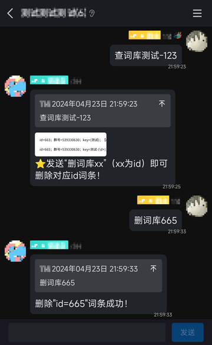

# 红色问答的词库系统插件

[红色问答](https://github.com/super1207/redreply)的插件，用于快速添加一些简单的自定义回复，匹配方式为**正则匹配**。

## ！！注意！！
修改初始化的`【设置主人@....】`改为自己qq。

优先级：**个人词库>群词库**。

`关键词`**不能**包含空格。`关键词`和`回复内容`之间必须**空格分开**。

`关键词`有多个`回复内容`，则随机发送一条。

## 添加词库
### 添词库`关键词` `回复内容`
匹配方式为正则匹配，即 `关键词` 填写**正则表达式**( `回复内容` 可引用正则表达式里对应分组，例如${1}或者$1 )。

添加后**仅自己**发送 `关键词` **匹配的消息** 可以触发回复`回复内容`

### 添群词库`关键词` `回复内容`
匹配方式为正则匹配，即 `关键词` 填写**正则表达式**( `回复内容` 可引用正则表达式里对应分组，例如${1}或者$1 )。

添加后**当前群群友**发送 `关键词` **匹配的消息** 可以触发回复`回复内容`

### 添总词库`关键词` `回复内容`
总词库**仅主人**可添加。匹配方式为正则匹配，即 `关键词` 填写**正则表达式**。

`回复内容` 可以填写的是**脚本**，其中命令**可执行**，如【艾特】、【运行目录】等。

添加后**所有人**发送 `关键词` **匹配的消息** 可以触发回复`回复内容`

## 查删词库
### 查词库`消息`
`消息`填写**希望触发回复**的消息，返回**仅自己可以触发回复**的所有词条。
`消息`为可空返回**仅自己**的所有的词条。
主人可以查询到**任意人可以触发回复**的所有词条。
### 删词库`ID`
`ID`填写对应词条的 **id编号**（纯数字）。
主人可以删除任意词条。

## 词库说明
### 词库说明
回复词库系统详细使用方式（隐藏关于主人的用法）、

